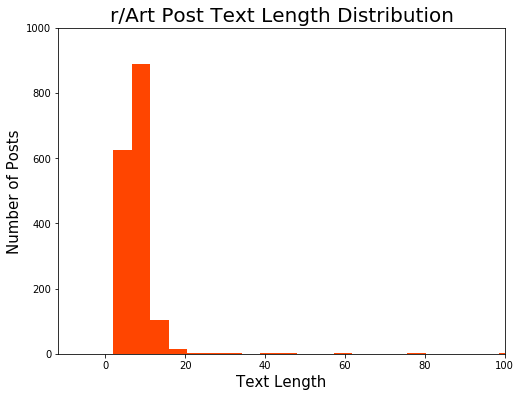
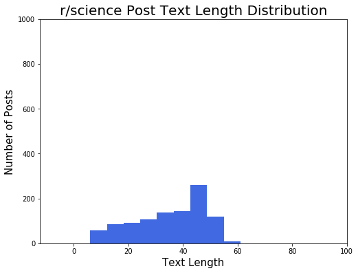
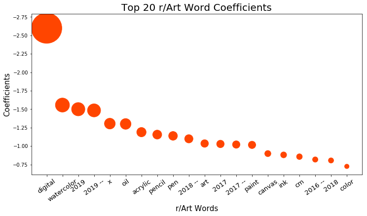
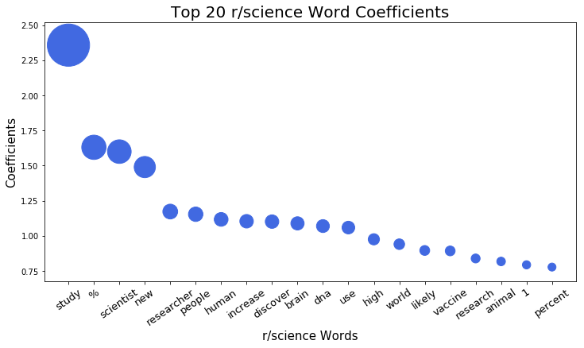

# Web APIs & Classification - Reddit

## Directory Structure

```
.
├── project_3
    ├── data
        ├── final_posts_art_sci.csv
    ├── plots
        ├── art_post_text_length_dist.png
        ├── art_word_coefficients.png
        ├── science_post_text_length_dist.png
        ├── science_word_coefficients.png            
    ├── reddit_api_and_classification.ipynb
    ├── README.md
    └── Project 3 - API & Classification - Reddit.pdf
```

## Executive Summary

As the fifth most visited site in the U.S. in 2019, Reddit has distinguished itself as the leading user-generated content provider of the internet. The users of the website, dubbed as "redditors", create posts on a wide range of topics - finance, sports, DIY, jokes, diet, etc., which is only a small sampling of the subjects discussed. These posts are organized by "subreddit", which serve as the forum for a specific interest. Through engagement of the redditors and the number of repeat views on the site, Reddit is able to generate robust revenues from targeted advertising, as well as from premium memberships, which allow redditors access to the site without any ads being shown. The strong community engagement, which leads to steady revenue streams, prompted a valuation of $1.8 billion during Reddit's last round of funding.

So how can Reddit increase its community engagement, and in turn increase revenues? One path we've identified would be to utilize Natural Language Processing (NLP) on the posts as redditors create them. Using a NLP model to analyze the words and phrases found within a post, it can then provide three outcomes that can foster conversation among redditors and increase community engagement:
1. Automatically recommend subreddits to which the post is relevant so that it can be seen by like-minded redditors
2. Include the post in multiple subreddits that may be related to its content, so that it accesses a wider interested audience
3. Suggest a list of hashtags to attach to the post, thereby linking it with trending or similar posts/topics and allowing for easier keyword searches

As a proof of concept, we created a project that took two subreddits and their respective top posts, put the data through a NLP model, and predicted whether a test sample of posts would belong to one subreddit or the other. Through the model building process, key insights were discovered about each subreddit and what distinguished each from the other. Since r/Art and r/science were selected for the project, we were able to generate very high accuracy scores for our dataset - 99.6% on the training data and 99.4% on the test data. The high accuracy scores were due to the fact that the two subreddits are in completely different domains with their own specific nomenclature. With this model, we are able to demonstrate the ability to clearly delineate an unrelated subreddit from another. In addition, we can surmise that if two related subreddits were chosen and the model had difficulty generating an accuracy score far beyond the baseline, possibly either subreddit could be recommended for that post or the post could be placed in both subreddits for maximum exposure. The model also calculated the top words and phrases that helped classify the post into each subreddit, which may be used to generate the relevant hashtags that connect to other posts/topics. 

While Reddit has seen its meteoric rise lead them to unicorn status with a billion dollar valuation, the shifting landscape of users' tastes and preferences mandate constant improvement. Reddit must strive to foster posts and conversations that drive redditors to continuously return to the site for fresh new content or pertinent responses to existing threads of interest. 

We have the dynamic next step for Reddit's ascent; let us work together toward the next iteration of growth for your future.

---

### Description of Data

#### Size

The Reddit post data consist of 2,666 rows (1,649 posts for r/Art, 1,017 posts for r/science), plus 104 columns of values. However, only a subset of the data will be used for this project. Please refer to the [Data Dictionary](#Data-Dictionary) section to see which columns were selected for the model.

       
#### Source

The data was scraped for this project by using a Reddit api:

- [final_posts_art_sci](./datasets/final_posts_art_sci.csv)

The file provides a wide range of metadata scraped from the Reddit r/Art and r/science subreddits, which is organized by post by row. Multiple CSV's were created during the data collection process, which was then consolidated into the above file. The data scraping occured during 7/1/2019 through 7/10/2019, and was sorted by top posts of all time for each subreddit. The data was originally in a json dictionary, but was converted to a pandas DataFrame for more efficient analysis.

You can see the source for the r/Art posts [here](https://www.reddit.com/r/Art/top/?t=all), and the source for the r/science posts [here](https://www.reddit.com/r/science/top/?t=all).


#### Data Dictionary

|Feature|Type|Description|
|---|---|---|
|author_fullname|object|The author of the post| 
|name|object|The name of the post| 
|permalink|object|The link address after www.reddit.com that specifically navigates to the post| 
|title|object|The title of the post| 
|selftext|object|The text of the post| 
|text|object|Created a new column that combines title and selftext so that all the post text is in one column| 
|text_count|int|Created a new column that counted the number of words in the text column| 
|science|int|Created a column to represent whether a post is from r/science, indicated with a '1', and from r/Art, indicated with a '0'| 

---

### Model Creation and Score

#### Model Steps

Below is a summary of steps to create a model that categorizes posts to a subreddit:
1. Gather posts from target subreddits and combine into one dataset
2. Clean the data and do preliminary EDA
3. Utilize stemming, lemmatization, regex, and/or stop words to create clean tokens
4. Choose transformers and models to use in a pipeline
5. Gridsearch for optimal parameters to fit the pipeline
6. Check the scores of the models
7. Explore the features, create a Confusion Matrix, calculate error metrics and make adjustments to clean tokens if necessary

#### Pipelines

3 pipelines were created for this project:
1. CountVectorizer and Multinomial Naive Bayes
2. CountVectorizer and Logistic Regression
3. TFIDFVectorizer and Logistic Regression

#### Optimal Parameters 

After putting the data through the pipelines, the GridSearchCV was utilized to generate the optimal parameters for the CountVectorizer. We started with 100-500 max_features, but the parameters bumped up against the high range, so the feature number was increased until the GridSearch no longer picked the highest number of features. The min_df was set at 2 so that rare words that occured in only one post would be excluded. Stop_words were excluded from the transformation to reduce noise on the data. A Lemmatizer function was used to pass through the CountVectorizer transformation to generate better results by tallying the roots of the words.

1. CountVectorizer and Multinomial Naive Bayes
- max_features=2000
- min_df = 2
- ngram_range = (1,1)
- tokenizer = my_tokenizer
- stop_words = stop_words
    
2. CountVectorizer and Logistic Regression
- max_features=2000
- min_df = 2
- ngram_range = (1,3)
- tokenizer = my_tokenizer
- stop_words = stop_words

3. TFIDFVectorizer and Logistic Regression
- max_features=1000
- min_df = 2
- ngram_range = (1,2)
- tokenizer = my_tokenizer
- stop_words = stop_words

#### Model Scores

Baseline accuracy for the dataset is 61.9%

1. CountVectorizer and Multinomial Naive Bayes - 99.6% train and 99.4% test 
2. CountVectorizer and Logistic Regression - 100.0% train and 99.3% test 
3. TFIDFVectorizer and Logistic Regression - 99.7% train and 99.3% test 

The pipeline with the highest test accuracy scores is CountVectorizer and a MultinomialNB model, with an accuracy score of 99.4% on the test data. However, all 3 models were very close in accuracy scores.

---

### Data Visualization

#### Posts Text Length

A histogram of posts and their text length was created for both r/Art and r/science to show their respective distributions.

 

- Max limit of the x-axis was set at 100 even though there are a few outlier posts with more than 100 words, so that visually the plots don't have too much white space
- Max limit of the y-axis was set to 1,200 so that the two subreddits are on the same scale
- r/science averaged of 36 words per post, and had posts distributed up to 60 words
- r/Art averaged of 8 words per post, with most of the posts coming in under 20 words
- 62% of the data coming from r/Art (1,649 posts)
- 38% coming from r/science (1,017 posts)
- Intentionally included more posts for r/Art than r/science since the posts from r/science contained more text summarizing articles, whereas r/Art posts usually only have titles

#### Word Coefficients

The top 20 words with the highest and lowest coefficients in the pipeline with a CountVectorizer and a LogisticRegression model was calculated and converted to a scatterplot.



- Inverted the y-axis scale since the lowest negative coefficients meant more impact for r/Art classification
- "Digital", "watercolor", "oil", "paint", "pen", "acrylic", "pencil", "ink", "canvas", "paint", and "color" are all words related to the tools and mediums that artists use
- Based on the coefficient of -2.6 for "digital", the appearance of that word in a post would indicate an 93.1% chance that the post is from r/Art



- "Study", "scientist", "vaccine", "discover", "brain", "dna", and "researcher" are words that jump out for r/science, as these terms all seem relevant to science
- Based on the coefficient of 2.357438 for "study", the appearance of that word in a post would indicate an 91.4% chance that the post is from r/science

---

## Conclusion

Following the 7 steps to build a model for post classification to a subreddit will lead to insights about each - the words that distinguish one sub against another, the kind of content found within the posts, and how redditors engage each forum. Utilizing this insight, Reddit can find new ways to foster the conversation between redditors and drive up user base engagement - whether that's through subreddit recommendations, post placement in multiple subreddits, or hashtag generation to link to other posts or trending topics.
 

### Next Steps

- Utilize regex to clean the tokens more thoroughly
- Investigate other models such as knn, decision trees, random forests, SVM, etc.
- Perform the same analysis on the comments section of the subreddit
- Explore the 4 posts that caused type I errors (one r/Art post that comes to mind is a digital artwork of Stephen Hawking)

---

Outside References:

- https://www.reddit.com/
- https://en.wikipedia.org/wiki/Reddit
- https://towardsdatascience.com/hacking-scikit-learns-vectorizers-9ef26a7170af
- https://spacy.io/
- https://stackoverflow.com/questions/24386489/adding-words-to-scikit-learns-countvectorizers-stop-list


